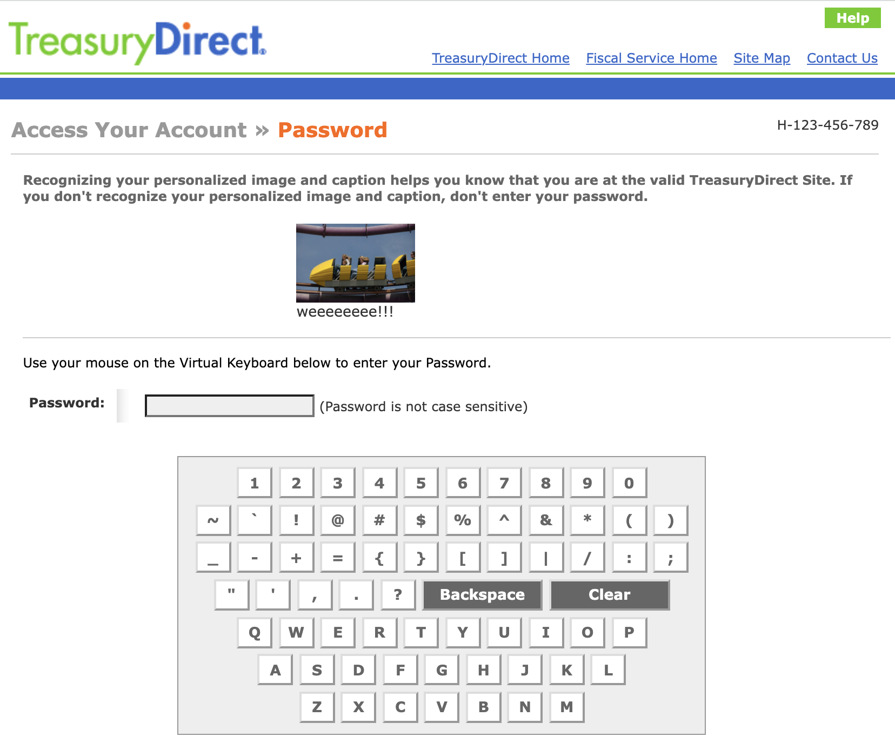

# Treasury Direct Password Enable User Script

A userscript to enable user input (and autocomplete for password managers) on the Treasury Direct website (
treasurydirect.gov)

Want to use a password manager, or type in your password using the keyboard under your fingertips, and not the on-screen
one on TreasuryDirect.gov?

This user script is for you.

## Installation

[Click here to install](https://github.com/ChrisCarini/treasury-direct-password-enable-user-script/raw/main/treasury-direct-password-enable.user.js)

_(**Note:** Your user script manager (see [Prerequisites](#Prerequisites) section below) should prompt you to install.)_

## Prerequisites

1) You will need a user script manager installed on the browser you wish to use to login to TreasuryDirect.gov

[Tampermonkey](https://www.tampermonkey.net/) (no affiliation) is a common user script manager.

Below are links for the extension for common browsers below:

- [Chrome](https://chrome.google.com/webstore/detail/tampermonkey/dhdgffkkebhmkfjojejmpbldmpobfkfo)
- [Firefox](https://addons.mozilla.org/en-US/firefox/addon/tampermonkey/)
- [Safari](https://apps.apple.com/app/apple-store/id1482490089)
- [Microsoft Edge](https://microsoftedge.microsoft.com/addons/detail/tampermonkey/iikmkjmpaadaobahmlepeloendndfphd)
- [Opera](https://addons.opera.com/en/extensions/details/tampermonkey-beta/)